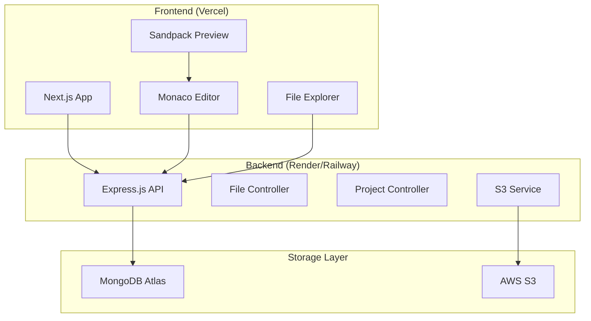

# Design Document

## Overview

CipherStudio is a full-stack online React IDE that provides developers with a complete development environment in the browser. The system architecture follows a modern three-tier approach with a React/Next.js frontend, Node.js/Express backend, and a hybrid storage solution using MongoDB Atlas for metadata and AWS S3 for file content.

The application implements a real-time development workflow where users can create, edit, and preview React applications instantly using Sandpack's in-browser execution environment. The system maintains project state through a sophisticated file hierarchy model and provides seamless persistence across user sessions.

## Architecture

### High-Level Architecture



### Technology Stack Implementation

| Component | Technology | Justification |
|-----------|------------|---------------|
| **Frontend Framework** | React.js with Create React App | Component-based architecture, familiar development experience |
| **Code Editor** | Monaco Editor | Rich editing features, JavaScript support, extensible |
| **Code Execution** | Sandpack (@codesandbox/sandpack-react) | Secure in-browser React execution, real-time preview |
| **Backend API** | Express.js with JavaScript | RESTful API design, middleware support, rapid development |
| **Database** | MongoDB Atlas | Document-based storage ideal for hierarchical file structures |
| **File Storage** | AWS S3 | Scalable object storage for code files, CDN integration |
| **Authentication** | JWT with bcrypt | Stateless authentication, secure password hashing |

### System Flow

1. **Project Creation**: User creates project → Backend generates projectId → MongoDB stores metadata → S3 stores default files
2. **File Operations**: User modifies files → Monaco Editor captures changes → Real-time sync to backend → S3 content update
3. **Live Preview**: Code changes → Sandpack processes → Real-time React rendering → Error handling display
4. **Project Persistence**: Save operation → MongoDB metadata update → S3 content sync → Version consistency check

## Components and Interfaces

### Frontend Components

#### 1. Main Layout Component
```javascript
// MainLayout.js - Three-panel layout: FileExplorer | CodeEditor | LivePreview
// Props: { project, onProjectChange }
```

#### 2. File Explorer Component
```javascript
// FileExplorer.js
// Props: { 
//   files: array of file nodes,
//   selectedFile: string or null,
//   onFileSelect: function,
//   onFileCreate: function,
//   onFileDelete: function
// }

// FileNode structure:
// {
//   id: string,
//   name: string,
//   type: 'file' or 'folder',
//   parentId: string or null,
//   children: array (optional),
//   isExpanded: boolean (optional)
// }
```

#### 3. Code Editor Component
```javascript
// CodeEditor.js
// Props: {
//   file: file content object or null,
//   onChange: function,
//   onSave: function,
//   language: string
// }

// FileContent structure:
// {
//   id: string,
//   name: string,
//   content: string,
//   isDirty: boolean
// }
```

#### 4. Live Preview Component
```javascript
// LivePreview.js
// Props: {
//   files: object mapping filename to content,
//   entry: string (main entry file),
//   onError: function
// }
```

### Backend API Interfaces

#### 1. Project Controller
```javascript
// projectController.js
// Functions:
// - createProject(userId, name) -> returns Promise<Project>
// - getProject(projectId) -> returns Promise<Project>
// - getUserProjects(userId) -> returns Promise<Project[]>
// - updateProject(projectId, updates) -> returns Promise<Project>
// - deleteProject(projectId) -> returns Promise<void>
```

#### 2. File Controller
```javascript
// fileController.js
// Functions:
// - createFile(projectId, parentId, name, type) -> returns Promise<FileMetadata>
// - getFile(fileId) -> returns Promise<FileWithContent>
// - updateFileContent(fileId, content) -> returns Promise<void>
// - deleteFile(fileId) -> returns Promise<void>
// - getProjectFiles(projectId) -> returns Promise<FileMetadata[]>
```

#### 3. S3 Service
```javascript
// s3Service.js
// Functions:
// - uploadFile(key, content) -> returns Promise<string>
// - getFile(key) -> returns Promise<string>
// - deleteFile(key) -> returns Promise<void>
// - generateKey(projectId, fileName) -> returns string
```

## Data Models

### MongoDB Collections

#### 1. Users Collection
```javascript
// User document structure:
// {
//   _id: ObjectId,
//   email: string,
//   passwordHash: string,
//   createdAt: Date,
//   updatedAt: Date
// }
```

#### 2. Projects Collection
```javascript
// Project document structure:
// {
//   _id: ObjectId,
//   userId: ObjectId,
//   name: string,
//   description: string (optional),
//   createdAt: Date,
//   updatedAt: Date,
//   lastAccessedAt: Date
// }
```

#### 3. Files Collection
```javascript
// FileMetadata document structure:
// {
//   _id: ObjectId,
//   projectId: ObjectId,
//   name: string,
//   type: 'file' or 'folder',
//   parentId: ObjectId or null (null for root folder),
//   s3Key: string (only for files, not folders),
//   size: number (file size in bytes, optional),
//   createdAt: Date,
//   updatedAt: Date
// }
```

### File Hierarchy Logic

The file system uses a parent-child relationship model:
- **Root Level**: Files/folders with `parentId: null`
- **Nested Structure**: Each file/folder references its parent via `parentId`
- **Content Storage**: Only files have `s3Key`; folders store structure only
- **Recursive Operations**: Deletion cascades through all children

### S3 Key Structure
```
projects/{projectId}/files/{fileId}/{fileName}
```

## Error Handling

### Frontend Error Boundaries

#### 1. Global Error Boundary
```javascript
// ErrorBoundary.js - React class component
// State structure:
// {
//   hasError: boolean,
//   error: Error or null,
//   errorInfo: ErrorInfo or null
// }

// Catches React component errors and displays fallback UI
```

#### 2. Sandpack Error Handling
```javascript
// SandpackError structure:
// {
//   message: string,
//   line: number (optional),
//   column: number (optional),
//   fileName: string (optional)
// }

// Displays compilation and runtime errors in preview pane
```

### Backend Error Handling

#### 1. API Error Response Format
```javascript
// APIError response structure:
// {
//   success: false,
//   error: {
//     code: string,
//     message: string,
//     details: any (optional)
//   },
//   timestamp: string
// }
```

#### 2. Error Categories
- **Validation Errors** (400): Invalid input data
- **Authentication Errors** (401): Invalid or missing JWT
- **Authorization Errors** (403): Insufficient permissions
- **Not Found Errors** (404): Resource doesn't exist
- **Server Errors** (500): Database or S3 failures

### Error Recovery Strategies

1. **Auto-retry**: Network requests with exponential backoff
2. **Graceful Degradation**: Offline mode with local storage fallback
3. **User Feedback**: Clear error messages with suggested actions
4. **State Recovery**: Preserve unsaved work during errors

## Testing Strategy

### Frontend Testing

#### 1. Unit Tests
- **Component Testing**: React Testing Library for UI components
- **Hook Testing**: Custom hooks with @testing-library/react-hooks
- **Utility Testing**: Pure functions and helpers

#### 2. Integration Tests
- **API Integration**: Mock backend responses with MSW
- **File Operations**: End-to-end file management workflows
- **Sandpack Integration**: Code execution and preview functionality

#### 3. E2E Tests
- **User Workflows**: Playwright for complete user journeys
- **Cross-browser**: Chrome, Firefox, Safari compatibility
- **Responsive Design**: Mobile and desktop layouts

### Backend Testing

#### 1. Unit Tests
- **Controller Logic**: Jest for API endpoint logic
- **Service Layer**: Database and S3 operations
- **Middleware**: Authentication and validation

#### 2. Integration Tests
- **Database Operations**: MongoDB test database
- **S3 Operations**: LocalStack for S3 simulation
- **API Endpoints**: Supertest for HTTP testing

#### 3. Performance Tests
- **Load Testing**: Artillery for API performance
- **File Upload**: Large file handling
- **Concurrent Users**: Multiple simultaneous operations

### Testing Data Management

#### 1. Test Database
- **Isolated Environment**: Separate MongoDB instance
- **Data Seeding**: Consistent test data setup
- **Cleanup**: Automated test data removal

#### 2. Mock Services
- **S3 Mocking**: LocalStack for development
- **External APIs**: Nock for HTTP mocking
- **Time Mocking**: Jest fake timers

## Security Considerations

### Authentication & Authorization
- **JWT Tokens**: Short-lived access tokens with refresh mechanism
- **Password Security**: bcrypt with salt rounds ≥ 12
- **Session Management**: Secure token storage and rotation

### Data Protection
- **Input Validation**: Joi schemas for all API inputs
- **SQL Injection**: MongoDB parameterized queries
- **XSS Prevention**: Content Security Policy headers
- **CORS Configuration**: Restricted origin policies

### File Security
- **S3 Bucket Policies**: Private buckets with IAM access
- **File Type Validation**: Whitelist allowed file extensions
- **Size Limits**: Maximum file and project size restrictions
- **Content Scanning**: Basic malware detection

## Performance Optimization

### Frontend Performance
- **Code Splitting**: Dynamic imports for large components
- **Lazy Loading**: File content loaded on demand
- **Memoization**: React.memo and useMemo for expensive operations
- **Virtual Scrolling**: Large file trees with react-window

### Backend Performance
- **Database Indexing**: Compound indexes on frequently queried fields
- **Caching**: Redis for frequently accessed project data
- **Connection Pooling**: MongoDB connection optimization
- **Rate Limiting**: API request throttling

### Network Optimization
- **CDN**: CloudFront for S3 file delivery
- **Compression**: Gzip for API responses
- **HTTP/2**: Modern protocol support
- **Prefetching**: Predictive resource loading

## Deployment Architecture

### Frontend Deployment (Vercel)
- **Build Process**: Create React App build optimization
- **Environment Variables**: Secure API endpoint configuration
- **Domain Configuration**: Custom domain with SSL
- **Analytics**: Performance monitoring integration

### Backend Deployment (Render/Railway)
- **Container Deployment**: Docker-based deployment
- **Environment Management**: Secure secrets handling
- **Health Checks**: Application monitoring
- **Auto-scaling**: Load-based instance scaling

### Database & Storage
- **MongoDB Atlas**: Managed database with automated backups
- **AWS S3**: Cross-region replication for reliability
- **Monitoring**: CloudWatch for AWS services
- **Backup Strategy**: Automated daily backups with retention